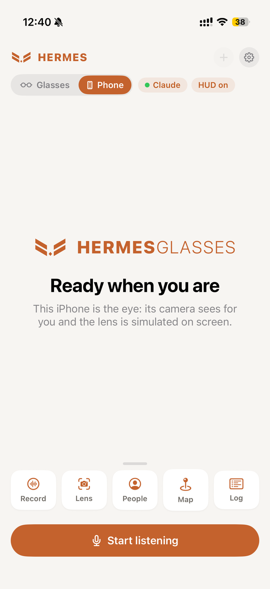
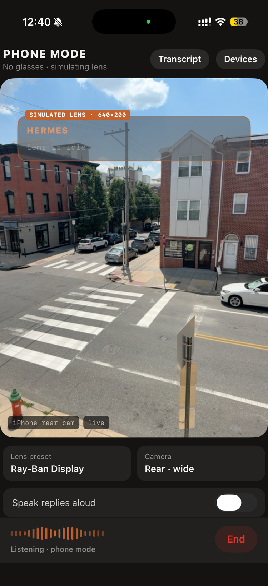
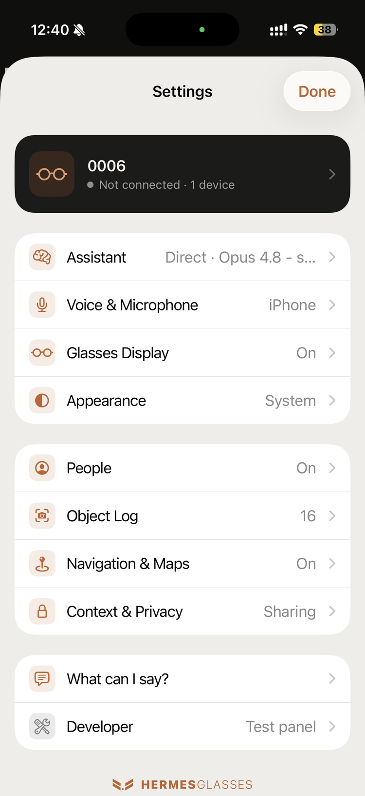
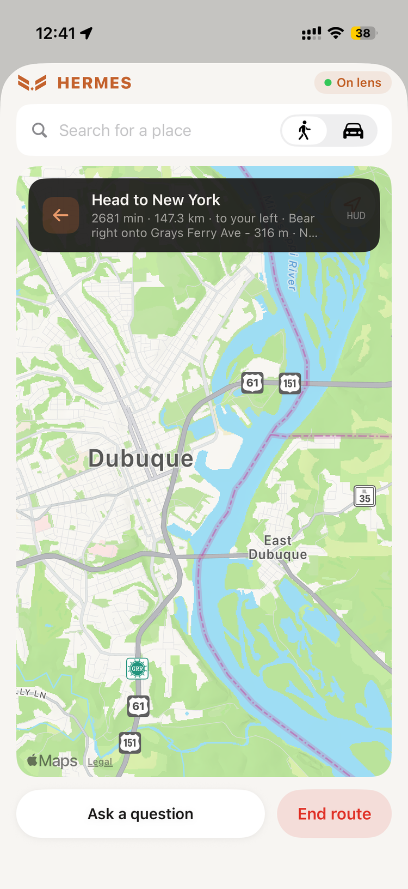
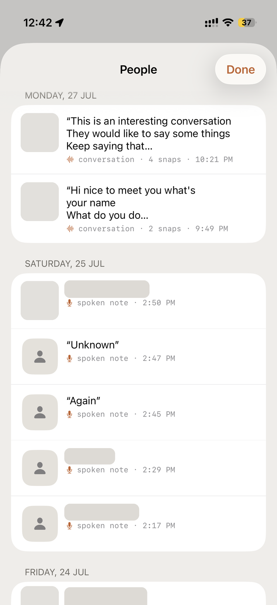
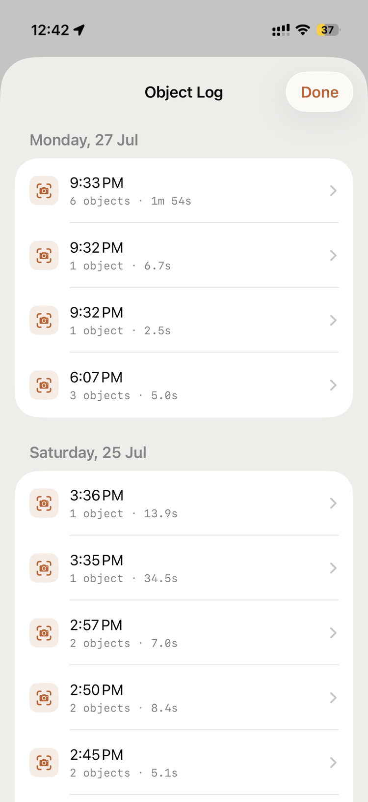

# Hermes Glasses

Talk to your own AI through smart glasses - **Meta Ray-Ban**, or **AiSee**
and other sub-$100 Realtek-based AI glasses (RTL8773D + RTL8735B reference
design) - with hands-free voice conversations, live on-device transcription,
computer vision through the glasses camera ("what am I looking at?"),
voice-started navigation on the lens, and a private, on-device memory of the
people you meet. Bring your own
API key for a zero-infrastructure setup, or point it at a Hermes Agent for
full agentic, tool-using conversations. No glasses at hand? Phone mode runs
every feature from the iPhone alone, with a simulated lens on screen.

A standalone, MIT-licensed project.

## Demo

<p align="center">
  
  &nbsp;&nbsp;
  
</p>
<p align="center"><em>On the Ray-Ban Display lens - a spoken reply (left) and live transcription (right), fully hands-free.</em></p>

<p align="center">
  
  &nbsp;&nbsp;
  
  &nbsp;&nbsp;
  
</p>
<p align="center"><em>Home with the quick actions, the simulated lens in phone mode, and the settings hub.</em></p>

<p align="center">
  
  &nbsp;&nbsp;
  
  &nbsp;&nbsp;
  
</p>
<p align="center"><em>Voice-started navigation, People (conversation captures and spoken notes), and the Object Log.</em></p>

<p align="center">
  
</p>
<p align="center"><em>Bridge mode: a visual query captures a glasses photo and answers in ~5&nbsp;s.</em></p>

## What it does

### Talk

- 🎙️ **Live transcription** - your words appear on screen as you speak, using
  Apple's on-device speech recognition (no audio leaves the phone for STT)
- 🤖 **Ask anything** - finished utterances go straight to your chosen AI
  provider (Direct mode) or to a Hermes Agent running on your Mac (bridge
  mode), and the answer is spoken back through text-to-speech
- 👓 **Lens HUD** - on Ray-Ban Display glasses, transcription and replies
  render on the lens itself; silent mode shows the text without speaking it
- 🔘 **Choice buttons** - a reply that offers options ("A) Sydney, B)
  Melbourne…") becomes tappable buttons on the lens and chips in the chat;
  tapping one submits the option's words
- 🧠 **Device context** - queries can carry the moment (time, location,
  motion, connectivity, battery, weather) so "where can I get coffee?" gets a
  local answer

### See

- 📷 **Vision** - say "what am I looking at?" and the app captures a photo
  from the glasses camera and the AI answers about the image
- 🔍 **Object Snap (Lens)** - a live glasses feed with on-device YOLO object
  detection; hold an object in the reticle for 2 s and it's snapped into the
  Object Log - no AI, no network
- 🧭 **Navigation** - "take me to the station" starts a walking or driving
  route with no AI round-trip: a turn-by-turn banner and a heading-aware map
  on the lens, and a full map screen (with place search) in the app
- 📖 **Definitions** - "what is a quokka?" answers as usual and puts a
  Wikipedia image next to the text on the lens
- 👓 **AiSee and other Realtek-based glasses** - a second glasses vendor
  alongside Meta: pick it under Settings › Devices › Glasses. Camera stills
  for visual queries and "remember this person", the live feed for Lens, the
  glasses' Opus microphone for the voice loop, and the temple button mapped
  to actions (tap / double tap / triple tap → start-stop listening, "what am
  I looking at?", snap a photo, remember this person). No HUD. Any glasses
  built on Realtek's AI-glasses SDK (`RTKAIDeviceConnection`) should work -
  these typically retail under $100.
- 🤝 **"Remember this person"** - snaps a glasses photo while you speak a
  note about who you just met
- 🗣️ **"Record this conversation"** - captures the full transcript plus
  automatic snaps of the people you're talking to (a 2 s look triggers a
  snap), then re-transcribes from the recording for a cleaner result
- 📛 **Badge reading** - name badges in snaps are read by on-device OCR and
  used to group sightings into a timeline per person; an opt-in AI pass can
  fill in badges the on-device reader missed
- 🔒 **Private by design** - encounters, snaps and transcripts are stored on
  this iPhone only and never touch the AI, the bridge, or the network (the
  one exception, AI badge reading, is off by default)

### No glasses? Phone mode

- 📱 **The iPhone is the eye** - a Glasses/Phone toggle picks the camera; a
  simulated Ray-Ban Display lens renders on screen, so every feature above
  works with no glasses at all (and Auto falls back when glasses are out of
  reach)
- 🎧 **Headset mode** - mic and TTS live in your earbuds while the glasses
  lens keeps the HUD - the pocket setup
- 💬 **"What can I say?"** - a settings page listing every voice command,
  generated from the intent detectors themselves so it never drifts

## Architecture

There are two runtime paths. **Direct (your API)** needs no server - the phone
calls your provider itself:

```
┌─────────────┐   Bluetooth    ┌──────────────┐     HTTPS      ┌─────────────────────┐
│  Ray-Ban    │ ─────────────▶ │  iPhone app  │ ─────────────▶ │  Your AI provider   │
│  glasses    │  (DAT SDK:     │  (SwiftUI)   │  query +       │  Claude · OpenAI ·  │
│             │   camera)      │  on-device   │  base64 photo  │  Gemini · Ollama    │
└─────────────┘                │  STT + TTS   │ ◀───────────── │                     │
                               └──────────────┘   reply text   └─────────────────────┘
```

**Hermes agent (bridge)** routes through a Mac running the agent (tools +
memory), over a WebSocket:

```
┌─────────────┐   Bluetooth    ┌──────────────┐    WebSocket     ┌──────────────────┐
│  Ray-Ban    │ ─────────────▶ │  iPhone app  │ ───────────────▶ │  Mac bridge      │
│  glasses    │  (DAT SDK:     │  (SwiftUI)   │  text queries +  │  (Python)        │
│             │   camera)      │              │  base64 photos   │                  │
└─────────────┘                │  on-device   │ ◀─────────────── │  hermes chat CLI │
                               │  live STT    │  responses + TTS │  + edge-tts      │
                               └──────────────┘    (PCM 24 kHz)  └──────────────────┘
```

- **iOS app** (`HermesGlasses/`) - SwiftUI app using the
  [Meta Wearables Device Access Toolkit](https://github.com/facebook/meta-wearables-dat-ios)
  0.8.0 for glasses registration, sessions, and camera capture, plus
  `SFSpeechRecognizer` for live on-device transcription. In Direct mode,
  `HermesGlasses/Services/Providers/` calls the provider API directly; in
  bridge mode, `HermesAPIClient` talks to the Mac bridge over WebSocket.
- **Bridge** (`bridge/hermes_bridge.py`) - a small Python WebSocket server on
  the Mac. Receives text queries, detects visual questions by keyword, requests
  a photo from the app when needed, invokes `hermes chat -q ... [--image ...]`
  (or calls a provider API directly), and streams back the reply text plus TTS
  audio (Edge TTS with macOS `say` fallback).

### WebSocket protocol (app ⇄ bridge, port 8765)

Only used in **Hermes agent (bridge)** mode - Direct mode never opens this
connection.

| Direction | Message | Meaning |
|---|---|---|
| app → bridge | `{"type":"query","text":...}` | Transcribed utterance (STT is on-device) |
| bridge → app | `{"type":"capture_photo"}` | Take a photo with the glasses now |
| app → bridge | `{"type":"photo","data":"<base64 jpeg>"}` | Captured photo |
| app → bridge | `{"type":"photo_error","message":...}` | Capture failed - answer text-only |
| bridge → app | `{"type":"response","text":...}` | Hermes's answer |
| bridge → app | `audio_start` / binary PCM16 24 kHz / `audio_end` | Spoken reply |

Binary frames from the app are reserved for mic audio (legacy server-side STT
path, still supported by the bridge). The bridge's `HERMES_BRIDGE_BRAIN` env
var now supports `anthropic` / `openai` / `gemini` (direct provider call) in
addition to the default `hermes` (agentic CLI with tools + memory).

## Setup

### Requirements

- iPhone with iOS 17+, Xcode 16+
- Meta Ray-Ban glasses paired with the Meta AI app
- A **Meta App ID + Client Token** for the glasses SDK, from the
  [Meta Wearables Developer Center](https://wearables.developer.meta.com/)
  (create a project → Configuration → the *Application ID* section
  auto-generates them). Copy `Config/Secrets.example.xcconfig` to
  `Config/Secrets.xcconfig` (gitignored) and fill in `META_APP_ID` /
  `CLIENT_TOKEN` - they're injected into `Info.plist`'s `MWDAT` dict at build
  time, so nothing sensitive is committed. In the Developer Center also
  register your app's **Bundle ID** (Meta rejects hyphens) and **Team ID**.
  See the [iOS DAT integration docs](https://wearables.developer.meta.com/docs/develop/dat/build-integration-ios/).
- **Path A (Direct):** an API key from your chosen provider - nothing else.
- **Path B (Hermes bridge):** additionally, macOS with Python 3.11+ and a
  working Hermes Agent install (`hermes chat` on PATH).

Pick one of the two paths below - you don't need both.

### Path A - Direct (your API), zero infrastructure

Build the app to your iPhone, then in the app go to
**Settings → Assistant → Backend: Direct (your API)**, pick a **Provider**
(Claude / OpenAI / Gemini / Local (Ollama)), paste your API key (or set a
**Base URL** instead, for Ollama or an OpenAI-compatible proxy), pick a
**Model**, and start talking. No Mac, no bridge - everything runs from the
phone, and keys are stored in the iPhone Keychain, one per provider.

1. Open `HermesGlasses.xcodeproj`, set your signing team, build to your iPhone.
2. In the app: **Connect Glasses** → complete registration in the Meta AI app.
3. **Settings → Assistant → Backend: Direct (your API)** → choose a Provider,
   Model, and paste your key.
4. Start a session. First run prompts for microphone + speech recognition
   permissions. The **glasses camera permission is granted via the Meta AI
   app** - Hermes asks for it right after pairing, and it can also be granted
   later from Settings → Devices or the test panel's Photo button.

### Path B - Hermes agent (bridge), full agentic assistant

For tool use and cross-turn memory, run a [Hermes Agent](https://hermes-agent.nousresearch.com)
on your Mac and point the app at it over WebSocket.

1. Install Hermes:
   ```bash
   curl -fsSL https://hermes-agent.nousresearch.com/install.sh | bash
   ```
   (or use the desktop installer - see the
   [installation docs](https://hermes-agent.nousresearch.com/docs/getting-started/installation)).
   This puts the `hermes` CLI on your PATH.
2. Run the bridge:
   ```bash
   cd bridge
   pip install websockets edge-tts
   python hermes_bridge.py
   # → listens on ws://0.0.0.0:8765/voice
   ```
   Copy `bridge/.env.example` to `bridge/.env` to configure it - in
   particular, `HERMES_BRIDGE_TOKEN` is **required** if the bridge is
   reachable from the internet (clients then connect with
   `ws://host:8765/voice?token=<value>`).
3. In the app: build to your iPhone, **Connect Glasses**, then
   **Settings → Assistant → Backend: Bridge (server)** and set the endpoint
   to `ws://<your-mac-ip>:8765/voice`. The "Bridge" chip in the banner turns
   green when the bridge is reachable.

The bridge's `HERMES_BRIDGE_BRAIN` env var can also be set to `anthropic`,
`openai`, or `gemini` to skip the Hermes CLI and call that provider's API
directly from the bridge - but **those direct-provider brains are
single-turn only (no conversation memory)**; use the default `hermes` brain
for cross-turn history and tool access. If you do use a direct-provider
brain, make sure `HERMES_BRIDGE_MODEL` matches the chosen brain's provider
(e.g. a Claude model id only works with `anthropic`, an OpenAI model id only
works with `openai`).

### Comparison

| | Direct (your API) | Hermes agent (bridge) |
|---|---|---|
| Infra needed | none - just the app | a Mac running the bridge + Hermes |
| Providers | Claude, OpenAI, Gemini, local (Ollama) | Hermes agent (or bridge-side provider) |
| Tools / agentic | no | yes |
| Vision | yes | yes |
| Keys live in | iPhone Keychain | bridge environment |

## Testing

Use the built-in test panel (**Settings → Developer**). It works from a cold
start - no session needs to be running, except for the bridge tests, which
need the socket:

| Button | Verifies |
|---|---|
| Bridge | WebSocket connectivity + welcome handshake |
| Photo | Glasses camera capture alone (also runs the permission grant) |
| Query | Bridge → Hermes → response → TTS round trip |
| Visual | Full photo + vision pipeline |
| Display | Renders a test card on the lens HUD |

Bridge-side unit tests:

```bash
cd bridge && python -m unittest test_hermes_bridge -v
```

### Build for device and simulator

```bash
# iOS device
xcodebuild -project HermesGlasses.xcodeproj -scheme HermesGlasses \
  -destination 'generic/platform=iOS' build

# iOS simulator
xcodebuild -project HermesGlasses.xcodeproj -scheme HermesGlasses \
  -destination 'generic/platform=iOS Simulator' build
```

See [`CONTRIBUTING.md`](CONTRIBUTING.md) for the standalone Swift provider
test suite and the full build/test workflow.

## Project layout

```
HermesGlasses/
├── Models/yolo11n.mlpackage           # bundled on-device object detector
├── Services/
│   ├── HermesSpeechRecognizer.swift   # on-device live STT
│   ├── HermesAudioManager.swift       # mic capture + TTS playback + mic switching
│   ├── HermesCameraManager.swift      # glasses camera (DAT): photos + live stream
│   ├── PhoneCameraManager.swift       # iPhone camera (phone mode)
│   ├── HermesDisplayManager.swift     # lens HUD on Ray-Ban Display
│   ├── HermesAPIClient.swift          # WebSocket client (bridge mode)
│   ├── DirectClient.swift             # Direct-mode conversation loop
│   ├── Providers/                     # AIProvider seam (Claude/OpenAI/Gemini/Ollama)
│   ├── Navigation/                    # voice intents, routing, bearing, lens maps, Wikipedia
│   ├── Social/                        # encounters, conversation capture, badge OCR
│   └── Lens/                          # object detection, dwell tracking, object log
├── ViewModels/                        # session orchestration, registration
└── Views/                             # SwiftUI screens (design system: HermesDesign.swift)
bridge/
├── hermes_bridge.py                   # WebSocket bridge on the Mac
├── .env.example                       # bridge configuration template
└── test_hermes_bridge.py              # unit tests
tests/                                 # standalone swiftc test suites, one dir per unit
docs/superpowers/                      # design specs and implementation plans
```

## Status / known limitations

- Voice loop and vision loop are working end-to-end on device, in both
  Direct and bridge modes.
- The microphone is switchable (iPhone / glasses / headset), but the glasses
  mic is Bluetooth HFP, and an active HFP link makes the glasses firmware
  show its call screen over the lens - so it's **mic or HUD, not both**.
  Headset mode is the workaround: mic + TTS in the earbuds, HUD on the lens.
- Someone speaking quietly across the table may be missed by conversation
  capture - the phone mic is tuned for the wearer. The recording is kept so
  a better transcription can recover it later.
- Glasses photos may arrive rotated (EXIF orientation not yet normalized).
- Visual-query detection is keyword-based ("look", "what is this", …).

## Discussion

Write-ups and demos, with questions answered in the comments:

- [r/SideProject - "I built an app that lets you talk to your own AI…"](https://www.reddit.com/r/SideProject/comments/1uvhx6l/i_built_an_app_that_lets_you_talk_to_your_own_ai/)
- [r/augmentedreality - "My AI agent lives on my Meta Ray-Bans. I asked it…"](https://www.reddit.com/r/augmentedreality/comments/1v0dbcy/my_ai_agent_lives_on_my_meta_raybans_i_asked_it/)
